# Urban Disaster Monitor: Detecção e Classificação de Pessoas em Cenários de Desastre

 [](https://colab.research.google.com/drive/1ids-NQ6EfzGgfK41BWvkIXxOkUomexo0?usp=sharing)  

Sistema inteligente de visão computacional para **detecção e classificação de civis e socorristas** em cenários de desastre urbano, utilizando **YOLOv8**.

<p align="center">
  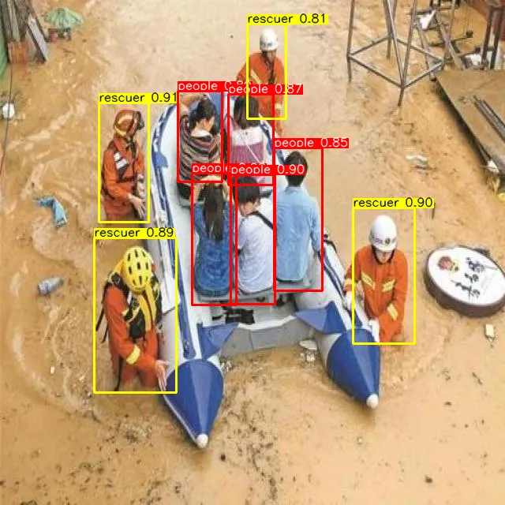 
  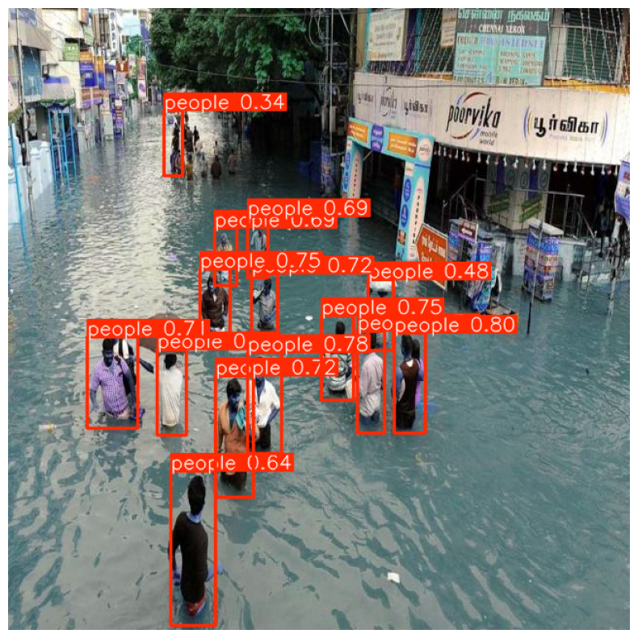
</p>

`YOLOv8` • `visão computacional` • `desastres naturais` • `detecção de pessoas` • `cidades inteligentes` • `socorristas` • `gradio` • `imagem e vídeo`

---

## 📑 Sumário

- [Funcionalidades](#-funcionalidades)
- [Introdução](#-introdução)
- [Dataset](#-dataset)
- [Metodologia](#-metodologia)
- [Resultados e discussões](#-resultados-e-discussões)
  - [Avaliação em Imagens Estáticas](#avaliação-em-imagens-estáticas)
  - [Avaliação em Vídeo](#️-avaliação-em-vídeo)
  - [Gráficos e Visualizações](#-gráficos-e-visualizações)
  - [Discussões](#discussões)
- [Conclusões](#-conclusões)
- [Interface Interativa](#-interface-interativa)
- [Tecnologias](#-tecnologias)
- [Equipe do Projeto](#-equipe-do-projeto)
- [Repositório de Dados](#-repositório-de-dados)
- [Estrutura do Projeto](#-estrutura-do-projeto)
- [Como Executar](#-como-executar)
- [Referências Bibliográficas](#-referências-bibliográficas)

---

## 🔍 Funcionalidades

- Detecção de pessoas em **imagens** e **vídeos**
- Diferenciação entre **civis** e **socorristas**
- Treinamento com **YOLOv8**
- Interface interativa via **Gradio**
- Visualização de **métricas e bounding boxes**

---

## 📌 Introdução

Eventos de **desastre urbano**, como colapsos estruturais, inundações e deslizamentos de terra, impõem desafios significativos às operações de resposta e resgate. A capacidade de **identificar e categorizar rapidamente** indivíduos como civis ou socorristas em tempo real é crucial para a otimização da alocação de recursos e a minimização de fatalidades. Imagens coletadas por veículos aéreos não tripulados (VANTs), sistemas de vigilância e dispositivos móveis representam uma fonte de dados valiosa para esta finalidade.

Este projeto propõe o desenvolvimento de um **sistema inteligente de visão computacional** para a **detecção e classificação discriminativa de indivíduos (civis e socorristas)** em ambientes impactados por desastres urbanos. Utilizando a arquitetura de **detecção de objetos YOLOv8 (You Only Look Once, versão 8)**, o objetivo é construir uma ferramenta robusta e eficiente capaz de fornecer suporte crítico a autoridades e equipes de emergência durante a fase de resposta a desastres.

Desenvolvido durante a disciplina de Visão Computacional na **Escola de Ciências e Tecnologia (ECT/UFRN)** em trabalho voluntário para o **Smart Metropolis Lab (SMLab)** do **Instituto Metrópole Digital (IMD/UFRN)**, este trabalho é parte integrante do **Projeto SPICI (Segurança Pública Integrada em Cidades Inteligentes)**. O SPICI visa criar uma plataforma inteligente para coleta, processamento e análise de imagens e informações críticas em tempo real, contribuindo para a gestão de crises e desastres por meio de tecnologias avançadas como visão computacional e inteligência artificial. O `Urban Disaster Monitor` alinha-se diretamente com os objetivos do SPICI ao fornecer uma ferramenta especializada para a identificação de pessoas em cenários de desastre, agregando valor à capacidade de resposta e tomada de decisão da plataforma.

<a href="https://smlab.imd.ufrn.br/">
  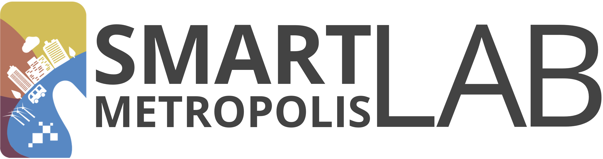
</a>

<a href="https://smlab.imd.ufrn.br/projeto-spici/">
  
</a>

<a href="https://imd.ufrn.br/">
  
</a>

<a href="https://www.ect.ufrn.br/">
  
</a>

---

## 📂 Dataset

- **Total de imagens**: 2403
- **Fontes**: dados reais + imagens sintéticas
- **Classes**:
  - `people` (civis)
  - `rescuer` (socorristas com EPI)
- **Anotado via**: [Roboflow](https://roboflow.com)

---

## ⚙️ Metodologia

- Arquitetura: `YOLOv8s` e `YOLOv8n`
- Aumento de dados: rotação, ruído, brilho, etc.
- Treinamento: 30 e 50 épocas comparadas
- Métricas principais:
  - `mAP@0.5`, `mAP@0.5:0.95`
  - `Precision`, `Recall`
  - Matriz de confusão

### Aquisição e Anotação de Dados

Para o treinamento e validação do modelo, foi compilado um **dataset abrangente** composto por diversas imagens que representam cenários típicos de desastres urbanos (e.g., edifícios colapsados, áreas inundadas). As fontes incluem **repositórios públicos de imagens de desastres** e a **geração de imagens sintéticas** para complementar a variabilidade do conjunto de dados. Essa abordagem híbrida visa mitigar a escassez de dados reais de alta qualidade em ambientes de desastre.

A **anotação dos objetos de interesse** está sendo realizada na plataforma **Roboflow**, onde as classes primárias de interesse são definidas como:

- `People`: Indivíduos não identificados como membros de equipes de resgate.
- `Rescuer`: Indivíduos equipados ou identificáveis como parte de equipes de emergência (e.g., bombeiros, paramédicos), frequentemente distinguíveis por uniformes, equipamentos de proteção individual (EPI) ou posturas operacionais.

### Pré-processamento de Dados

As etapas de pré-processamento são cruciais para otimizar o desempenho do modelo e garantir sua generalização:

- **Redimensionamento**: Todas as imagens são escaladas para dimensões compatíveis com as entradas da arquitetura YOLOv8, balanceando a fidelidade da informação visual com a eficiência computacional.
- **Aumento de Dados (Data Augmentation)**: Técnicas de aumento de dados (e.g., rotação, translação, espelhamento, ajuste de brilho e contraste, _blurring_ e ruído) são aplicadas para aumentar a robustez do modelo, mitigar o risco de _overfitting_ e compensar potenciais desequilíbrios entre as classes. A diversificação do dataset através do _data augmentation_ é fundamental para simular a variabilidade das condições de imagem em cenários reais de desastre.
- **Particionamento**: O dataset é dividido em conjuntos de treino, validação e teste, tipicamente nas proporções 70%, 20% e 10%, respectivamente. Essa divisão estratificada assegura uma avaliação imparcial da capacidade de generalização do modelo para dados não vistos.

### Arquitetura do Modelo e Ferramentas

- **Modelo de Detecção**: **YOLOv8 (You Only Look Once, versão 8)**. Essa arquitetura foi selecionada por sua comprovada eficiência na detecção de objetos em tempo real, combinando alta acurácia com velocidade de inferência, características essenciais para aplicações em cenários emergenciais.
- **Tarefa**: Detecção de Objetos (Object Detection).
- **Frameworks e Bibliotecas**: O desenvolvimento e treinamento do modelo são realizados com **Ultralytics YOLOv8**, utilizando **PyTorch** como _backend_ de aprendizado profundo, e **OpenCV** para manipulação de imagens e pré-processamento de vídeo.

### Treinamento e Otimização do Modelo

O processo de treinamento envolve as seguintes fases, visando a otimização do desempenho do modelo:

1.  **Conversão de Anotações**: As anotações geradas no formato Roboflow são convertidas para o formato YOLO (`.txt`), que é o padrão de entrada para os modelos da família YOLO.
2.  **Treinamento Iterativo**: O modelo é treinado utilizando um conjunto de parâmetros otimizados, incluindo _batch size_, taxa de aprendizado (_learning rate_) e número de _epochs_. Técnicas de agendamento da taxa de aprendizado (_learning rate schedulers_) e otimizadores (e.g., Adam, SGD) são empregadas para acelerar a convergência e melhorar a performance.
3.  **Validação Contínua**: O desempenho do modelo é monitorado e validado em tempo real durante o treinamento utilizando métricas de desempenho padrão da área em um conjunto de validação separado. Isso permite identificar _overfitting_ e ajustar hiperparâmetros de forma dinâmica.
4.  **Testes e Avaliação**: Após o treinamento, o modelo é avaliado extensivamente em um conjunto de teste independente, contendo imagens reais e cenários não vistos, para verificar sua capacidade de generalização e robustez em condições adversas.

---

## 📊 Resultados e discussões

### Análise de Resultados e Métricas

A avaliação da eficácia do modelo será realizada através de um conjunto de métricas quantitativas e qualitativas, fornecendo uma análise abrangente do seu desempenho:

- **Métricas de Precisão Média (mAP)**:
  - **mAP@0.5**: _Mean Average Precision_ calculada com um _IoU (Intersection over Union)_ _threshold_ de 0.5. Essa métrica é comumente utilizada para avaliação rápida da precisão de detecção.
  - **mAP@0.5:0.95**: _Mean Average Precision_ calculada em múltiplos _thresholds_ de _IoU_, variando de 0.5 a 0.95 em etapas de 0.05. Essa métrica oferece uma medida mais robusta e abrangente da acurácia de localização e classificação das detecções.
- **Precisão (Precision) e Recall (Revocação)**: Avaliados por classe para compreender o desempenho individual na identificação de civis e socorristas, indicando a proporção de detecções corretas e a capacidade do modelo de encontrar todas as instâncias relevantes, respectivamente.
- **Matriz de Confusão (Confusion Matrix)**: Essencial para visualizar e analisar os tipos de erros (falsos positivos, falsos negativos) cometidos pelo modelo, especialmente a confusão entre as classes de interesse, o que é crítico em cenários onde a distinção entre civis e socorristas é vital.
- **Análise Qualitativa**: Serão apresentadas visualizações das _bounding boxes_ e rótulos de classe sobre as imagens de teste. Essa análise visual permite uma avaliação subjetiva da acurácia das detecções e da capacidade do modelo de lidar com variações de escala, oclusão e iluminação.

Os resultados serão detalhadamente apresentados em relatórios técnicos e artigos científicos, incluindo gráficos e tabelas estatísticas, acompanhados de uma análise crítica sobre as limitações do modelo e o potencial de aplicação em contextos reais de desastre.

### Avaliação em Imagens Estáticas

Foram realizados testes qualitativos em imagens fora do treinamento de alagamentos para validar a capacidade de detecção do modelo YOLOv8 treinado em diferentes regimes de épocas (30 e 50).

- Com **30 épocas**, o modelo já era capaz de detectar pessoas e socorristas com precisão razoável.
- Com **50 épocas**, observou-se uma melhora clara nas imagens estáticas, com menos falsos positivos, corrigindo erros como a identificação incorreta de pessoas em postes ou áreas de sombra.

**Imagens utilizadas:**

<p align="center">
  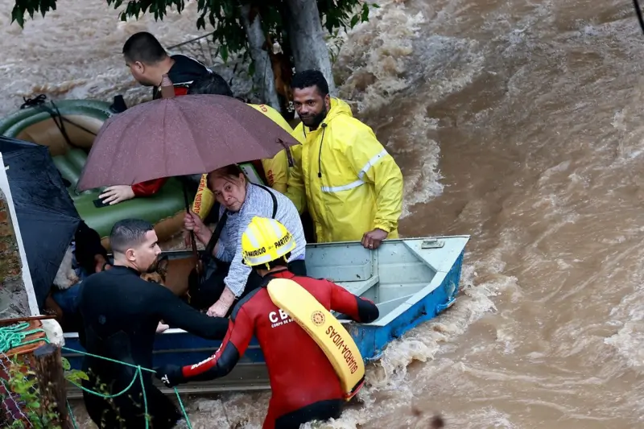
  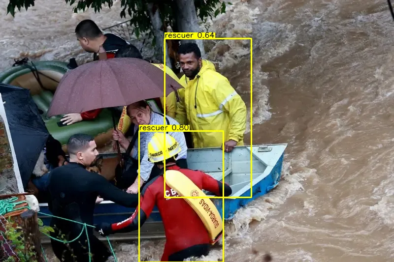
</p>

<p align="center">
  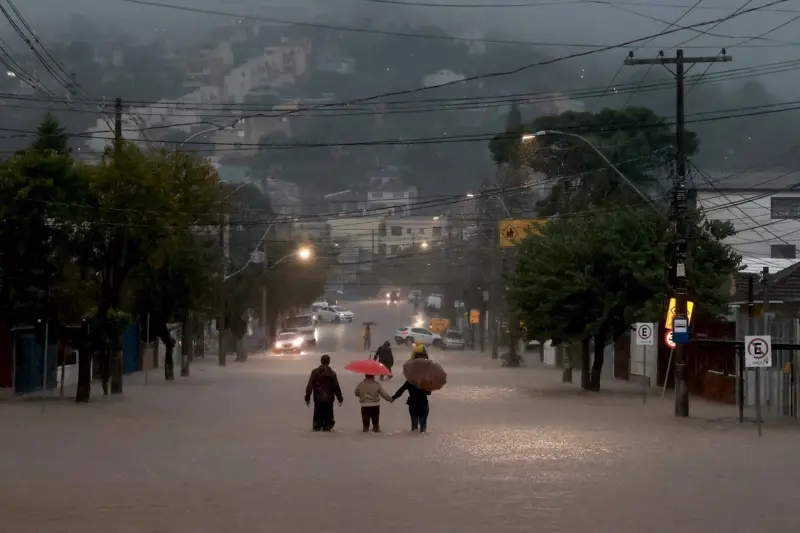
  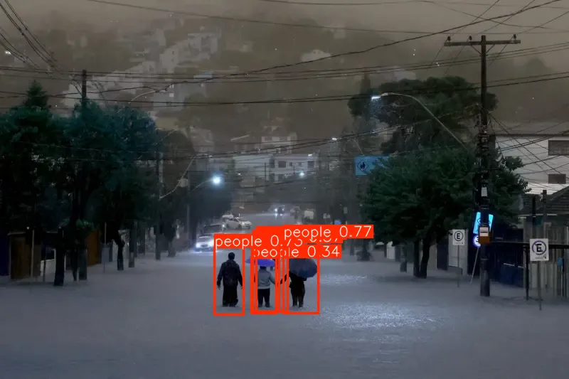
</p>

*Fonte das imagens: [BBC Brasil - Alagamentos em SP](https://www.bbc.com/portuguese/articles/cw00d51k5rlo)*

### 🎞️ Avaliação em Vídeo

Um vídeo público do YouTube foi utilizado para simular um cenário real de desastre urbano:

- O modelo com **30 épocas** apresentou maior estabilidade e consistência ao longo dos quadros.
- O modelo com **50 épocas**, embora superior para imagens, teve comportamento errático em vídeo, gerando detecções flutuantes e menos confiáveis — sugerindo possível overfitting ou limitação da generalização temporal.

[Vídeo utilizado no experimento](https://www.youtube.com/watch?v=QnFwDqzCwRU)

**Observação**: Treinar com mais de 50 épocas pode exigir hardware com maior capacidade de memória. Durante o experimento, o uso da conta acadêmica no Google Colab atingiu o limite de memória, reforçando a necessidade de infraestrutura mais robusta para lidar com sequências temporais (vídeos).

---

### 📊 Gráficos e Visualizações

**1. Gráfico de erro durante o treinamento**

30 épocas:

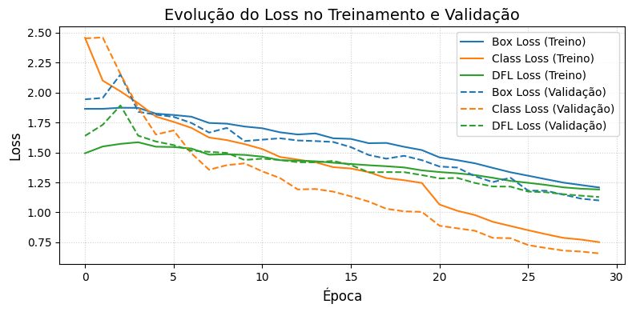

50 épocas:

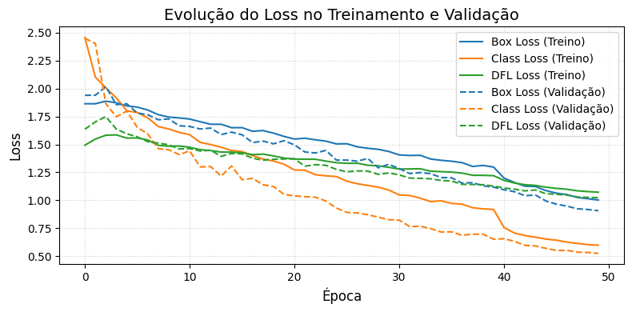

**2. Gráfico de métricas por época**

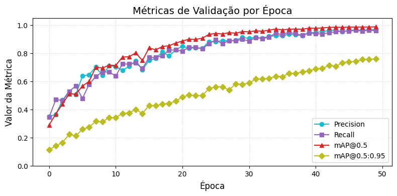

**3. Matriz confusão**

30 épocas:

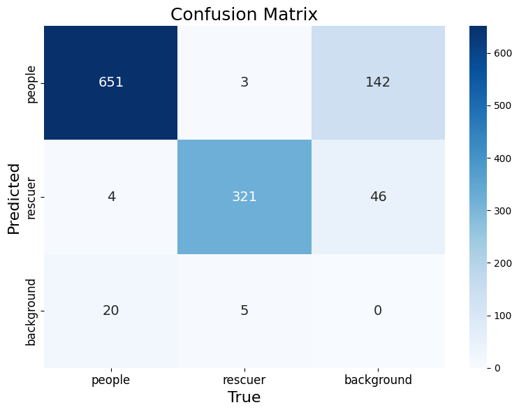

50 épocas:

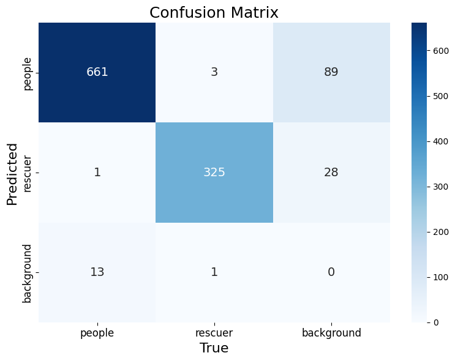

### Discussão

_(Esta seção será dedicada à discussão aprofundada dos resultados obtidos, incluindo a interpretação das métricas de desempenho, a identificação de pontos fortes e fracos do modelo, e a análise de possíveis vieses nos dados. Serão abordadas as limitações inerentes à metodologia, como a sensibilidade a condições de iluminação extremas, oclusão parcial ou total dos indivíduos, e a representatividade do dataset. Além disso, serão propostas futuras linhas de pesquisa para aprimoramento do sistema, como a integração de informações contextuais (e.g., sensores multiespectrais), a otimização para implantação em dispositivos de borda para inferência em tempo real e a exploração de arquiteturas de modelos mais leves. Finalmente, será discutida a integração do `Urban Disaster Monitor` como um módulo crucial dentro da plataforma SPICI, realçando seu impacto potencial na gestão inteligente de desastres e na coordenação de equipes de resgate.)_

---

## ✅ Conclusão

**30 épocas** → melhor desempenho em vídeos, com menos ruído nas detecções.

**50 épocas** → superioridade em imagens estáticas, com maior precisão espacial.

**Trabalhos futuros:**

- Ajuste de hiperparâmetros específicos para vídeo.
- Treinamento com dados temporais (ex: sequências ou ConvLSTM).
- Uso de infraestrutura com GPU dedicada (Google Colab Pro ou A100).

---

## 💻 Interface Interativa

A interface foi desenvolvida com **Gradio** e está disponível na Hugging Face.

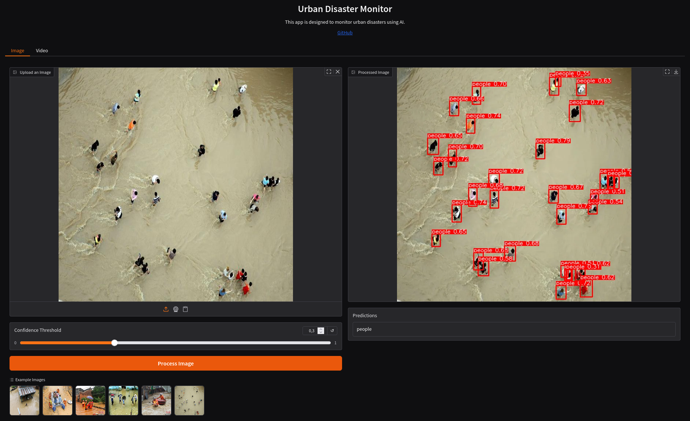

👉 Acesse: [https://huggingface.co/spaces/carolinasoares/urban\_disaster\_monitor](https://huggingface.co/spaces/carolinasoares/urban_disaster_monitor)

---

## 🛠️ Tecnologias

- [Python 3.10](https://www.python.org/)
- [YOLOv8 (Ultralytics)](https://docs.ultralytics.com)
- [OpenCV](https://opencv.org/)
- [Gradio](https://gradio.app/)
- [Matplotlib](https://matplotlib.org/)

---

## 👥 Equipe do Projeto

O desenvolvimento do `Urban Disaster Monitor` é realizado por alunos da disciplina de Visão Computacional, ministrada pelo professor [Helton Maia](https://heltonmaia.com/) da ECT/UFRN:

| [](https://github.com/jagaldino) | [](https://github.com/MariaCarolinass) | [](https://github.com/heltonmaia) |
| :---------------------------------------------------------------------------: | :---------------------------------------------------------------------------------------: | :-----------------------------------------------------------------------------: |
|                           **jagaldino** Pesquisador                           |                             **MariaCarolinass** Pesquisadora                              |                       **heltonmaia** Professor Orientador                       |

---

## 🧠 Repositório de Dados

O dataset anotado e pré-processado será disponibilizado para a comunidade científica (ou referenciado através de um link permanente) após a conclusão das etapas de anotação e validação, aderindo aos princípios de ciência aberta e reprodutibilidade.

- **Link Roboflow**: _(a ser adicionado)_
- **Formato das Anotações**: YOLOv8 (arquivos `.txt` contendo as coordenadas das _bounding boxes_ e os IDs das classes, acompanhados das imagens correspondentes, seguindo a convenção de nomenclatura do YOLO).

---

## 📁 Estrutura do Projeto

```
urban-disaster-monitor/
├── app/
│   ├── examples/
│   ├── models/
│   │   └── best30p.pt
|   |   └── best50p.pt
│   ├── app.py
│   ├── requirements.txt
│   ├── README.md
├── dataset/
│   ├── test/
│   ├── train/
│   ├── val/
│   ├── data.yaml/
│   └── README.md
├── notebooks/
│   │   └── urban_disaster_monitor.ipynb
├── static/
│   ├── images/
│   ├── graphics/
│   └── matrix/
├── config.py
├── train.py
├── README.md
└── LICENSE
```

---

## 🚀 Como Executar

Baixe o repositório:

```bash
git clone https://github.com/MariaCarolinass/urban-disaster-monitor.git
cd urban-disaster-monitor/app
```

Crie e ative o ambiente virtual venv:

```bash
python3 -m venv venv
source venv/bin/activate
```

Instale as bibliotecas:

```bash
pip install -r requirements.txt
```

Execute o projeto:

```bash
python app.py
```

---

## 📚 Referências Bibliográficas

- Projeto SPICI (Smart Platform for Images and Critical Information). Disponível em: [https://smlab.imd.ufrn.br/projeto-spici/](https://smlab.imd.ufrn.br/projeto-spici/)
- Ultralytics. **YOLOv8 Documentation**. Disponível em: [https://docs.ultralytics.com](https://docs.ultralytics.com)
- Roboflow. Disponível em: [https://roboflow.com](https://roboflow.com)
- Redmon, J.; Farhadi, A. (2018). **YOLOv3: An Incremental Improvement**. _arXiv preprint arXiv:1804.02767_. Disponível em: [https://arxiv.org/abs/1804.02767](https://arxiv.org/abs/1804.02767)
- Redmon, J.; Divvala, S.; Girshick, R.; Farhadi, A. (2016). **You Only Look Once: Unified, Real-Time Object Detection**. In: _Proceedings of the IEEE Conference on Computer Vision and Pattern Recognition (CVPR)_, pp. 779-788. Disponível em: [https://arxiv.org/abs/1506.02640](https://arxiv.org/abs/1506.02640)
